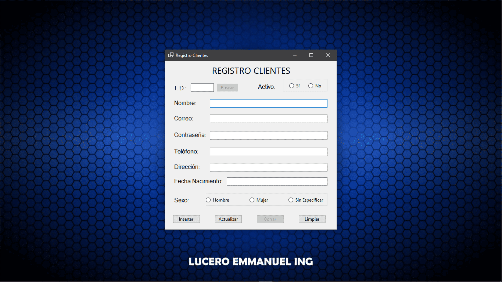

# 🧾 CRUD de Clientes con Interfaz Gráfica (WinForms + SQL Server)

Una aplicación de escritorio en **C#** que permite gestionar clientes mediante operaciones **CRUD** (Crear, Leer, Actualizar y Borrar) conectada a **SQL Server**, implementada con el patrón **MVC** y siguiendo buenas prácticas de desarrollo.

---

## 🎯 Funcionalidades

- ✅ Insertar nuevos clientes
- 🔎 Buscar clientes por ID
- ✏️ Editar datos existentes
- ❌ Borrado lógico (con campo `activo`)
- 💾 Conexión a SQL Server
- 🧩 Código organizado con patrón MVC

---

## 🖼️ Vista previa

### 🌟 Pantalla principal

<!-- Aquí puedes mostrar la ventana principal de la aplicación -->

### ✍️ Formulario de edición

<!-- Muestra los campos para editar cliente -->

### 🧪 Validaciones en acción

<!-- Imagen de campos con errores y el ErrorProvider activo -->

---

## 🧱 Estructura del proyecto
```
/RegistroClientes
├── /Controlador
│ └── FormController.cs
├── /Modelo
│ └── DatosClienteMetodos.cs
│ └── DatosClientes.cs
├── /Vista
│ └── Form1.cs
├── /Assets
│ └── pantalla-principal.png
│ └── formulario-edicion.png
│ └── validaciones.png
└── README.md
```
---

## ⚙️ Tecnologías utilizadas

- 🎨 **C# Windows Forms** — interfaz gráfica amigable
- 🗃️ **SQL Server** — almacenamiento y consultas
- 📐 **MVC** — separación clara de responsabilidades
- 💼 **ADO.NET** — para conectarse y ejecutar comandos SQL

---

## 🧠 Consideraciones

- El borrado lógico permite mantener un historial de clientes, pero puede complicar validaciones si no se controla adecuadamente.
- El campo **correo** es único para evitar duplicados.
- Valida los datos en capa de modelo antes de enviarlos al servidor.
- Usa `SCOPE_IDENTITY()` para recuperar el ID recién insertado si es necesario.

---

## 🚀 Cómo ejecutar

1. Clona el repositorio
2. Abre la solución en Visual Studio
3. Configura la cadena de conexión a tu SQL Server en el archivo correspondiente
4. Asegúrate de tener creada la tabla `Clientes` con este esquema:
   - `id` (PK, int, identity)
   - `nombre`, `correo`, `contrasenha`, `telefono`, `direccion`, `fechaNaci`, `sexo`, `activo`
5. Ejecuta la aplicación y comienza a gestionar tus clientes

---

## ✍️ Autor

**Lucero Emmanuel Ing**  
*Ingeniero en Desarrollo de Softare con enfoque en desarrollo de software funcional y estético.*

---

